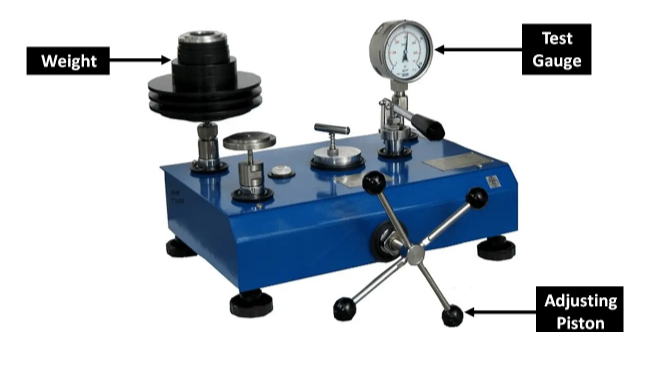
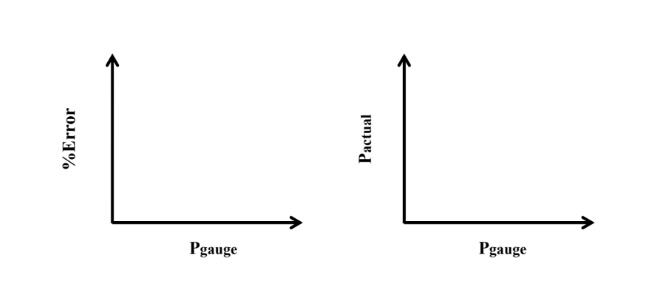

### Theory

Instrument calibration is one of the primary processes used to maintain instrument accuracy. It is the process of configuring an instrument to provide results within an acceptable range. Known weights have been applied on a Dead Weight Calibrator to apply pressure to a fluid for checking the accuracy of readings from a pressure gauge. Various types of pressure measuring instruments have been used to measure the pressure intensity at any point in static or moving fluid.

Dead Weight Testers are simple, low-cost instruments to calibrate pressure devices. Deadweight testers use calibrated weights to apply known pressures to a device under test for a simple and cost-effective solution that covers a wide range of pressure calibrations. A dead weight tester is an instrument that calibrates pressure by determining the weight of force divided by the area the force is applied. It basically works on the pressure balance principle with calibrated weights used to apply pressure to an area. When the pressure balance reaches zero, the pressure device under test is considered calibrated. 

Actual Instrument figure shown below:- 

### Description

The dead weight tester apparatus consists of a chamber which is filled with oil free impurities and a piston-cylinder combination is fitted above the chamber as shown in the diagram. The top portion of the piston is attached with a platform to carry weights. A plunger with a handle has been provided to vary the pressure of oil in the chamber. The pressure gauge to be tested is fitted at an appropriate plate.

The Bourdon gauge is the most popular pressure measuring device for both liquids and gasses. It can be connected to any source of pressure such as a pipe or vessel containing a pressurized fluid.

### Dead Weight Calibrator

In order to obtain very accurate pressure measurements, it is essential to regularly re-calibrate the gauge. This is because the tube tends to become weaker with extended use. The usual procedure is to apply a known pressure to the gauge using a device called a Dead Weight Calibrator. The normal calibration procedure is to load the gauge for known pressures, using a dead weight calibrator including a liquid of known specific gravity (use water as the liquid). This dead-weight tester uses a simple piston and cylinder arrangement to provide a source of pressurized liquid (in the experiment water will produce a better result than oil) which is transmitted to the gauge. Since the true pressure of the liquid can be easily calculated, the value can be compared directly to the reading on the gauge over the complete scale range. (The scale range is the range of pressures from zero to the full-scale deflection value). The dead weight tester consists of a cylindrical piston which is free to move vertically in a close fitting cylinder. A Platen is attached to the piston which can be loaded with a series of accurate weights. The pressure developed in the cylinder is transmitted via a transparent tube to the gauge under test. The cylinder is mounted on a base board which is supported on leveling screws and fitted with a spirit level.

### Working 

The following procedure is adopted to Gauge calibration:

Weights of known mass are loaded on one end of the piston and the fluid pressure is applied to the other end of the piston until enough force is developed to lift the piston.

Now by operating the plunger, fluid pressure is applied to the other side of the piston until enough force is developed to lift the piston-weight combination. When this happens, the piston weight combination floats freely within the cylinder between limit stops.

A deadweight tester generates pressure by exerting a force (F) over an area (A), which is also the definition of pressure (P): Pressure, by definition, is a derived parameter.
One cannot create an artifact of one pound per square inch or any other measure of pressure. Pressure is derived by the combination of a mass measurement imposed upon an area. It is commonly expressed in terms of pounds force or per unit area (Pounds per square inch). Pressure can also be expressed in terms of the height of a liquid column (Inches of water or millimeters of mercury) that produces the same pressure at its base.

P = F/A
Where Force = Mass X Acceleration due to gravity
i.e F= m.g 

Where:
F = Force applied to the liquid in the calibrator cylinder in Newton (N).
M = Total mass including the mass of the piston in kilogram (kg).
A = Cross-sectional area of the piston in square meters (m2 ).
g = Acceleration due to gravity in meters per square second (m/s2)
Mp = Mass of the piston (kg).
d = Diameter of the piston (m).
Kilogram (Force) per Square Meter = 14.22334 PSI

The pressure P which is caused due to the weights placed on the platform is calculated. After calculating P, the plunger is released.

Now the pressure gauge to be calibrated is installed in an appropriate place in the dead weight tester. The same known weight that was used to calculate P is placed on the platform. Due to the weight, the piston moves downwards and exerts a pressure P on the fluid. Now the valve in the device opens so that the fluid pressure P is transmitted to the meter, which causes the meter to indicate a pressure value. This pressure value shown on the indicator must be equal to the known inlet pressure P. If the indicator indicates any other value than p, the indicator is set to read a value equal to p. Therefore, the gauge is calibrated.

### Bourdon Gauge

The Bourdon Gauge (Figure 2) is fitted with a transparent dial, which lets you see the internal workings of the gauge. The gauge consists of a thin walled closed ended tube which is oval in cross-section. This tube is bent through an angle of about 270&deg;  along its long axis. The open end of the tube is welded to a hollow mounting block which allows the pressurized fluid to reach the tube. This causes the pressure from the source to be transmitted directly to the inside of the bourdon tube. The applied pressure causes the oval tube to become rounder (since a round cross-section has the maximum area for a given circumference). As it becomes rounder, the bourdon tube tends to uncurl which causes its free end to move. A system of linkages and levers transmits this motion to the gauge needle which moves over the scale.

### Advantages

- It is simple in construction and easy to use.
- It can be used to calibrate a wide range of pressure measuring devices.
- Fluid pressure can be easily varied by adding weights or by changing the piston cylinder combination.

### Disadvantage 

The accuracy of the dead weight tester is affected due to the friction between the piston and cylinder, and due to the uncertainty of the value of gravitational constant 'g'.

### Applications

It is used to calibrate all kinds of pressure gauges such as industrial pressure gauges, engine indicators, and piezoelectric transducers.

### Theoretical background and calculate

Relative Error = (Measured Value – Actual Value) /Actual Value
Percent Error = ¦Relative Error¦ × 100

### Graphical Relationship: Plot the following graphs

1.  Actual Pressure (Pactual) against Measured Pressure (Pguage) (Gauge Reading).
2.  Percent Error (%Error) against Measured Pressure (Pguage) (Gauge Reading).

